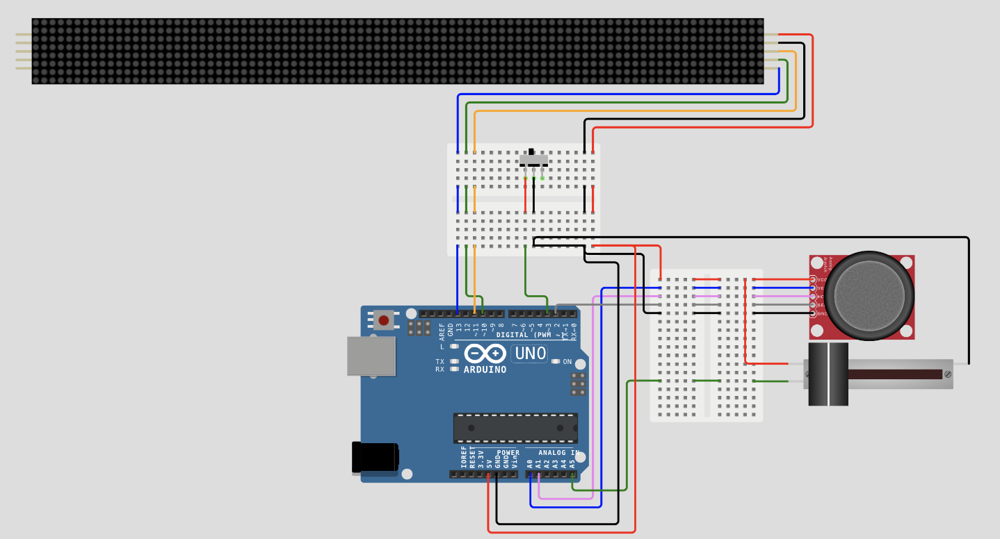

# KioskScrollingMessage

A customizable scrolling message display for kiosks or digital signage, implemented using an **Arduino Nano**, a **MAX7219 LED matrix**, and a simple button-based UI. The project simulates real-world kiosk behavior with smooth text animations and menu interaction.

---

## Table of Contents

* [Overview](#overview)
* [Features](#features)
* [Hardware Requirements](#hardware-requirements)
* [Wiring](#wiring)
* [Software Requirements](#software-requirements)
* [Installation](#installation)
* [Usage](#usage)
* [Repository Structure](#repository-structure)
* [Live Simulation](#live-simulation)
* [License & Credits](#license--credits)

---

## Overview

KioskScrollingMessage is a digital message scroller designed for real-time public displays. Its features and usability make it ideal for information booths, event kiosks, or smart signage.

The display scrolls a programmable message using a **MAX7219**-driven matrix and offers basic interactivity (e.g., pause, switch messages, brightness control) through button inputs or optional menu navigation via joystick.

---

## Features

* 🧾 **Smooth Scrolling Text** via MAX7219 8x8 matrices
* 🛠️ **Dynamic Message Control** (preset or live-editable)
* 🎚️ **Brightness Adjustment** using buttons or analog input
* 🔁 **Loop Modes**: Continuous scroll or single-run
* 📟 **Compact UI**: Optional menu mode with joystick navigation
* 🔋 **Low Power & Efficient** for portable deployment

---

## Hardware Requirements

* **Arduino Nano** (or Uno)
* **MAX7219 8x8 LED Matrix Module**
* **Pushbuttons** (1–3 for control)
* **Optional**: Analog joystick or rotary encoder
* Breadboard, wires, and 5V power supply

---

## Wiring

| Component        | Arduino Pin | Function              |
|------------------|-------------|------------------------|
| MAX7219 DIN      | D11         | Data In                |
| MAX7219 CLK      | D13         | Clock                  |
| MAX7219 CS/LOAD  | D10         | Chip Select            |
| Button 1         | D2          | Start/stop scroll      |
| Button 2         | D3          | Change message         |
| Button 3         | D4          | Adjust brightness/menu |

---

## Software Requirements

* Arduino IDE or PlatformIO
* Required Libraries:
  - `LedControl` or `MD_MAX72XX`
  - `Bounce2` (for debouncing button input)
  - (optional) `U8g2` if used for alternate menus

See `libraries.txt` for details.

---

## Installation

```bash
git clone https://github.com/aimanabed/KioskScrollingMessage.git
cd KioskScrollingMessage
```
Open kiosk_message.ino in Arduino IDE
Install required libraries via Library Manager
Connect the board, select the correct COM port, and upload
Usage

Scroll begins automatically on power-up
Press Button 1 to pause/resume
Press Button 2 to cycle between messages
Press Button 3 to enter brightness control (or toggle modes)
Adjust joystick or potentiometer for more refined control (if implemented)
Repository Structure
```
KioskScrollingMessage/
├── kiosk_message.ino           # Main sketch
├── diagram.json                # Wokwi simulation (if available)
├── libraries.txt               # Required libraries
├── presentation_kiosk.pptx     # Project presentation
└── README.md                   # This file
```
##  Live Simulation

Try the **Kiosk Scrolling Message Display** live on Wokwi:

[](https://wokwi.com/projects/426850658354700289)

[](https://wokwi.com/projects/426850658354700289)

## License & Credits

Tel Aviv University Educational License (TAU-EL)

Copyright (c) 2025 Aiman Abed

This project was developed as part of the Real-Time Systems Laboratory course (0512-4494) at Tel Aviv University.

Permission is hereby granted, free of charge, to use, copy, modify, and distribute this project and its components for **educational and non-commercial purposes**, subject to the following conditions:

1. This software is provided for academic and instructional purposes only.
2. Any reuse, modification, or publication must credit the original authors and Tel Aviv University.
3. This license does not grant permission for commercial use or redistribution in compiled or uncompiled form.
4. The software is provided "as is", without warranty of any kind, express or implied.

For permissions beyond the scope of this license, please contact Tel Aviv University or the original authors.

Developed by:

Aiman Abed – developer
Edward Khoury – Co-developer

<p align="center">
  
</p>
